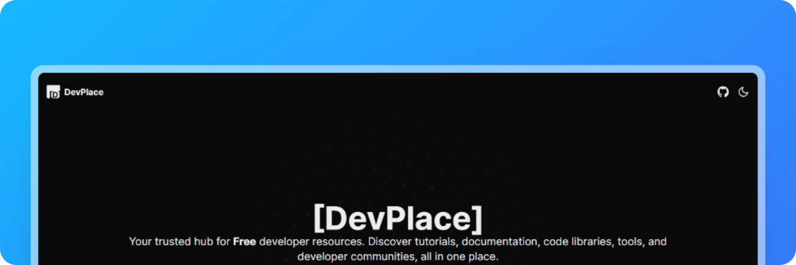

<h1 align="center">DevPlace</h1>

🧑‍💻 Your trusted hub for Free developer resources. Discover tutorials, documentation, code libraries, tools, and developer communities, all in one place.

## License

Licensed under the [MIT license](https://github.com/yossTheDev/devplace/blob/main/LICENSE.md).
